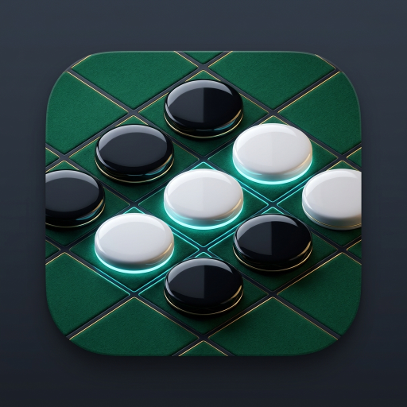
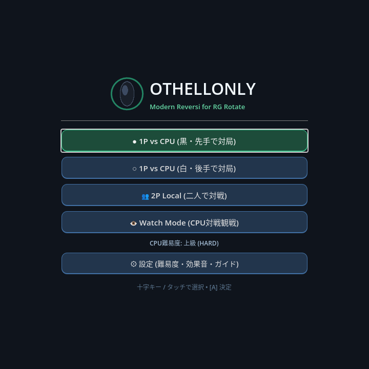
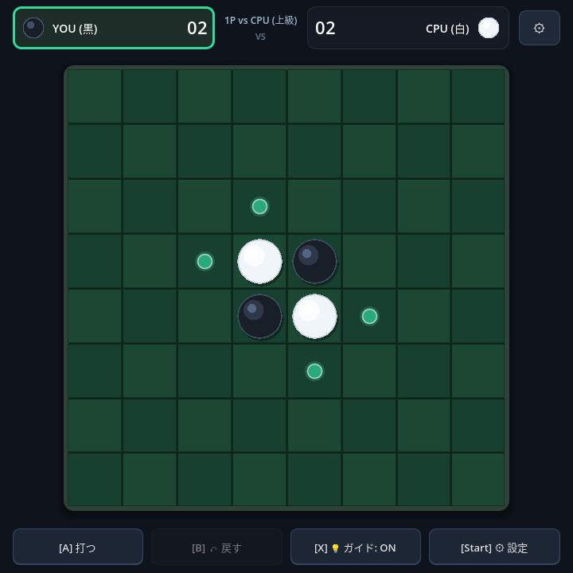

<p align="center">
  
</p>

<h1 align="center">Othellonly (Reversi) for RG Rotate / Android</h1>

<p align="center">
  <b>Godot Engine 4.x</b> で作成された、Android携帯機（物理コントローラー内蔵型・<b>RG Rotate</b>）およびタッチ端末向けのリバーシ（オセロ）ゲーム。<br>
  <b>720 × 720 (1:1 スクエア)</b> 画面に最適化されています。
</p>

---

## 📸 Screenshots (実機キャプチャ)

<p align="center">
  
  &nbsp;&nbsp;&nbsp;&nbsp;
  
</p>
<p align="center">
  <i>左: タイトル画面（モード・難易度選択） / 右: 対局画面（720×720 RG Rotate 実機）</i>
</p>

---

## 🎮 Features (主な機能)

- **ハイブリッド操作システム**:
  - **コントローラー操作**: 十字キー & 左スティックで選択カーソル移動、A/B/X/Startの物理ボタンで全操作が可能。
  - **タッチ操作**: 盤面マスや画面内の各ボタンを直接タップして快適に操作可能。
  - **シームレス自動切替**: タッチ時はカーソルが非表示となり、十字キー/スティック入力時に即座にカーソルが復帰。
- **3つの対戦モード**:
  1. `1P vs CPU (黒・先手 / 白・後手 選択可能)`
  2. `2P Local (1台の端末を交互に操作して対局)`
  3. `Watch Mode (CPU vs CPU 観戦モード)`
- **3段階のCPU AI難易度**:
  - **EASY (初級)**: ランダム着手
  - **NORMAL (中級)**: 貪欲法（最大反転枚数重視）
  - **HARD (上級)**: 静的評価テーブル + 動的四隅評価 + 開放度理論（相手の合法手削減）+ Alpha-Beta探索
- **上質なグラフィック & アニメーション演出**:
  - 3Dシェーディング付きオセロ石（ハイライト・ベベル・ドロップシャドウ）
  - Tweenによる立体回転・反転アニメーション（$X: 1.0 \to 0.0 \to 1.0$）
  - 合法手アシストガイド（光るガイドドット表示 ON/OFF）
  - 最終着手位置ハイライトマーカー
  - ネオン風コントローラー選択カーソル
- **システム & QoL機能**:
  - **一手戻す (Undo)**: 1P対戦時は自手番まで2手巻き戻し、2P対戦時は1手巻き戻し
  - **自動パス通知 (Toast)**: 合法手なし時のアニメーション付き通知バナー
  - **終局ダイアログ**: 勝敗判定・石数集計・再戦 / 設定変更
  - **一時停止・設定メニュー**: モード・難易度・効果音・ガイド設定・タイトル画面復帰
  - **完全内蔵プロシージャル効果音**: `SoundManager.gd` による波形合成（外部音声ファイル依存ゼロ）

---

## 🕹️ Controls (操作方法)

| 操作 | ゲームパッド (Physical Gamepad) | キーボード (Keyboard) | タッチ (Touch) |
|---|---|---|---|
| **カーソル移動** | 十字キー / 左スティック | 矢印キー / W, A, S, D | 盤面マスを直接タップ |
| **石を打つ (決定)** | **A ボタン** (`action_accept` / `btn_a`) | Enter / Space / Z | マスをタップ / `[A] 打つ` ボタン |
| **一手戻す (Undo)** | **B ボタン** (`action_cancel` / `btn_b`) | Esc / Backspace / X | `[B] 戻す` ボタン |
| **ガイド切替 (Hint)** | **X ボタン** (`action_x` / `btn_x`) | H / C | `[X] ガイド` ボタン |
| **設定・ポーズ** | **Start ボタン** (`ui_pause` / `btn_start`) | P / Esc | ⚙ ボタン / `[Start] 設定` ボタン |

---

## 📁 Architecture (アーキテクチャ設計)

```
othellonly/
├── project.godot                     # Godot 4.x プロジェクト設定 (720x720, canvas_items, InputMap)
├── export_presets.cfg                # Android エクスポート設定 (アイコン, 署名, パッケージ名)
├── icon.png                          # アプリアイコン (512x512)
├── scenes/
│   ├── Main.tscn                     # メインゲームシーン
│   ├── TitleScreen.tscn              # タイトル・スタート画面
│   ├── BoardView.tscn                # 8x8 盤面UI・グリッドコンテナ
│   ├── CellView.tscn                 # 盤面セル単体 Control
│   ├── TopBar.tscn                   # ヘッダー（スコア・手番・思考表示）
│   ├── BottomBar.tscn                # フッター（アクションボタン群）
│   ├── Toast.tscn                    # 通知ポップアップ
│   ├── PauseDialog.tscn              # 一時停止・設定モーダル
│   └── GameOverDialog.tscn           # 結果・勝敗モーダル
├── scripts/
│   ├── ReversiLogic.gd               # 純粋ゲームロジック (RefCounted / 盤面管理 / 合法手 / 反転 / Undo)
│   ├── AIController.gd               # AI思考ルーチン (EASY / NORMAL / HARD)
│   ├── BoardView.gd                  # 盤面描画・Tween反転演出・カーソル管理
│   ├── CellView.gd                   # 高DPI石描画・個別アニメーション・タップ検知
│   ├── GameController.gd             # 進行ステートマシン・入力調整
│   ├── SoundManager.gd               # プロシージャル効果音生成・再生
│   └── UI/
│       ├── TitleScreen.gd            # タイトル画面制御
│       ├── TopBar.gd                 # スコア・手番更新
│       ├── BottomBar.gd              # ボタン操作・ガイド切替
│       ├── Toast.gd                  # アニメーション通知
│       ├── PauseDialog.gd            # 設定変更・フォーカス管理
│       └── GameOverDialog.gd         # リザルト表示・フォーカス管理
└── tests/
    ├── test_reversi_logic.gd         # ロジック & AI 単体テスト
    ├── test_sound_manager.gd         # オーディオ合成テスト
    ├── test_game_integration.gd      # メインシーン統合テスト
    └── test_e2e_simulation.gd        # E2Eシミュレーションテスト
```

---

## 🚀 Running & Exporting

```bash
# Godot 4.x で実行 (PC)
godot --path .

# Android APK のビルド
godot --headless --export-debug "Android" "builds/othellonly.apk"

# 実機 (RG Rotate) へのインストール
adb install -r builds/othellonly.apk
```